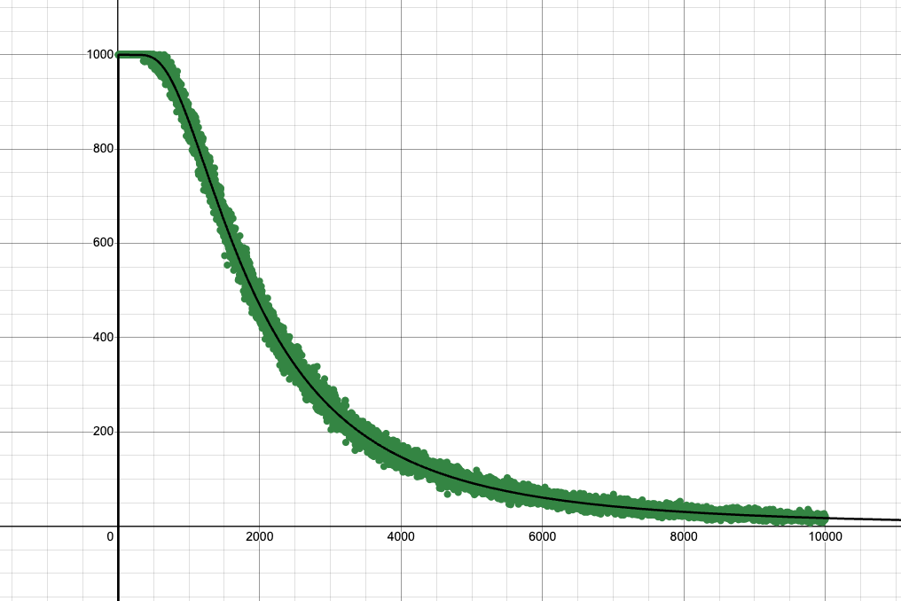
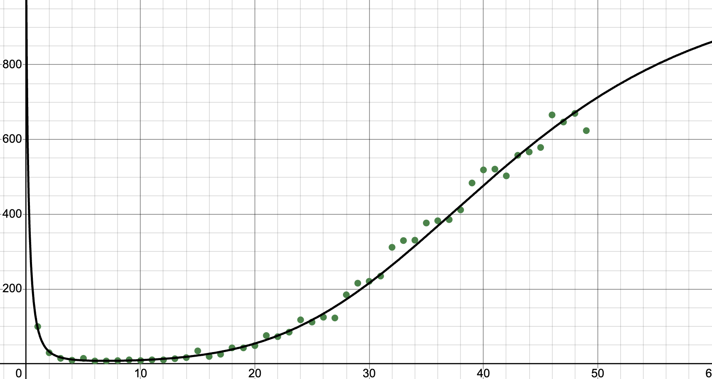

# bloom

A bloom filter

## Explanation

Bloom filters are a probabilistic data structure. Their purpose is to test set membership. (That is, it will either give you "for sure not in set" or "probably in set") Items can be added but not removed (unless you use a variant like Cuckoo filters). 

Some applications include caching, to only cache pages that are visited more than once, or for various set-membership checks where querying the whole dictionary constantly would be inconvenient (like screening websites for virus lists or something, or checking hyphenation rules). Also, according to Wikipedia, bloom filters are also used by flies. 

What's cool is that bloom filters never actually store the items that they check; A bloom filter of a certain set of parameters doesn't get bigger as you add more items, just less accurate. 

Anyways, let's cut to the chase. A bloom filter is defined to have $m$ bits in an array, and $k$ hash functions. When adding an item, you hash it $k$ times, and set all of those indices to one in the array. 

To check membership, you again hash three times and check all three indices. If at least one is not set to 1, then you know that the item is not in the set, since it would have been set to one. But if they are all set to 1, it could be that those bits were all set to 1 seperately while that item was actually never added. 

## Implementation

I thought bloom filters were pretty cool, so I wanted to code it up as a fun mini-project. Check the code in `src/main.rs`. 

## Failure rate

One interesting thing to model is how filters get stronger as you add more items. I set $k$ constant and increased $m$ from one to ten thousand. I did the following test:

Add 1000 unique elements

Get 1000 new unique elements, and test them all. None are actually in the set. The false-positive rate is the amount of ones that are reported, divided by 1000. 

My idea was to model this mathematically and to see if the model matches the empirics.

Each addition chooses three independent indices and sets them all to one. This means that for i iterations, each index has $ki$ bernoulli trials to get selected. Each time, it has a $m^{-1}$ chance. You can use PIE to determine this. The probability that after $i$ iterations an index is *never* selected is $\left(1-\frac{1}{m}\right)^{ki}$, so the probability of being selected at least once is one minus that, $1-\left(\left(1-\frac{1}{m}\right)^{ki}\right)$. For a false positive to be declared, all $k$ must have this condition pass, so the false positive rate is $\left(1-\left(1-\frac{1}{m}\right)^{ki}\right)^{k}$

The desmos graph strongly correlates this, yielding extremely high $R^2=0.9986$ and $R^2=0.9922$ for the $m$ and $k$ sweeps respectively.



And for the $k$ sweep: 




## Graphs:

https://www.desmos.com/calculator/ekpgh5ivgw

https://www.desmos.com/calculator/k4eg9cqjb8


## Run it yourself

Cargo must be installed. See https://doc.rust-lang.org/cargo/getting-started/installation.html .


To run:

```bash
cd /tmp/; git clone https://github.com/JBlitzar/myrust.git; cd myrust/bloom; cargo run --release
```

This produces the lists of numbers used in the Desmos analysis

## Resources

https://en.wikipedia.org/wiki/Bloom_filters

https://www.youtube.com/watch?v=V3pzxngeLqw