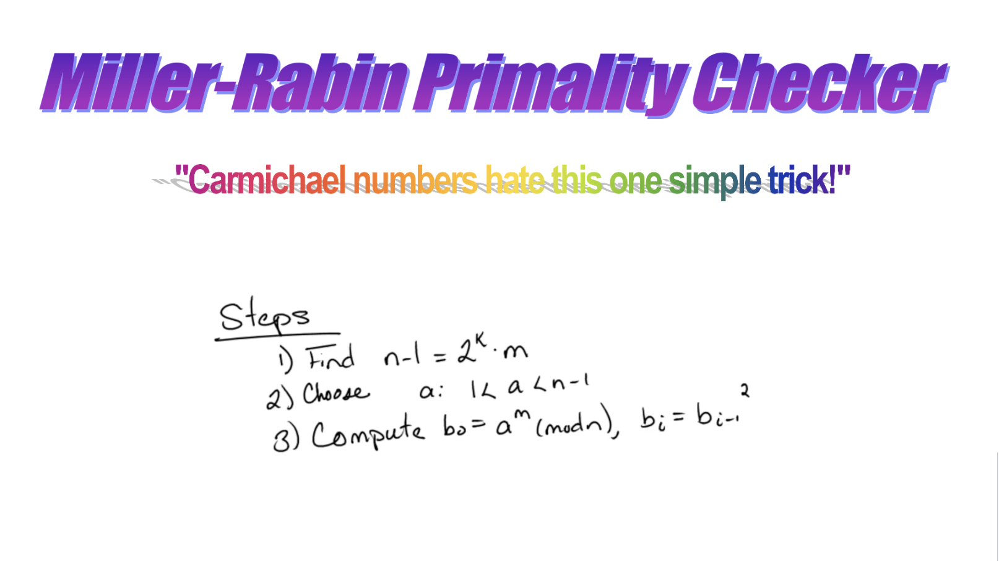

# Primes

## Miller Rabin Primality



### How does it work?

The Miller Rabin Primality test is a randomized algorithm to determine if a number is prime. There exist polynomial-time solutions, but this one is incredibly fast. Miller Rabin is used in modern production crypto systems _today_. This is because RSA, ECDH, DHKE, etc all rely on generating large prime numbers incredibly fast. Once you have two, you get a one-way function: It's easy to multiply two prime numbers to get a larger composite number, but much harder to factor that composite number [^1]

[^1]: \*Without Shor's algorithm

You can generate a 256-bit prime number as such:

- generate a random 256-bit number
- quickly check if it's prime (kind of the hard part)
- if it's not prime, repeat

For 256-bit primes, the PMT estimates a density of about $$\frac{1}{\ln\left(2^{256}\right)}$$, or one in 177. This means that it'll take "only" 177 tries or so to get a correct guess.

So how do we arrive at the algorithm described on the cover image?

The first thing you might think of is just guessing factors or using something like the Sieve of Eratosthenes. This works, but it's $$O(\sqrt{n})$$. This is usually very good, but in this case, with $n$ being $2^{256}$, we'll need something faster, like polynomial time in $\log n$.

It starts with Fermat's Little Theorem. It states that a if number is prime, $$x^{n-1} \equiv 1 (\text{mod} n) \forall x \in \mathbb{Z}, 0<x<n$$. Proofs for this can be found online for those who are interested. It's a bit out-of-scope for this writeup, since FLT's more number theory and less algorithms

The Fermat primality test goes something like this:

- Choose a random $x$ in $(1,n)$
- Check if it fails: if $x^{n-1} \neq 1 (\text{mod} n)$, then return "definitely composite"
- Repeat for as many random $x$ es as you'd like
- Otherwise, it's probably prime.

The exhaustive version is to check all $x$ es, and the probabilistic one is to only check some. This is the key idea in randomized algorithms: Trading correctness for speed. Luckily, with Miller Rabin, we'll be able to be very confident in correctness.

Unfortuantely, Carmichael numbers are an issue. They pass the Fermat Primality test but are composite. Remember, our statement of FLT is true, but the reverse is not necesarily true: There are some numbers (Carmichael numbers) that satisfy $x^{n-1} \equiv 1 (\text{mod} n) \forall x \in \mathbb{Z}, 0<x<n$. The Cornell pdf linked has number-theoretic justification for this, but the short version is that there are "Fermat Witnesses" and "Fermat Liars," and all of the trials that you run on Carmichael numbers are Fermat Liars. Carmichael numbers _do_ thin out as the magnitudes involved increase, but it's still no fun to have deterministic correctness problems with your primality tester.

The algorithm for Miller Rabin is similar to that of the Fermat Prime test, but instead of finding Fermat Witnesses to prove stuff, it finds "fake square roots." That is, a number $x \neq \pm 1 (\text{mod} n)$ where $x^2 \equiv 1 (\text{mod} n)$. If such a number $x$ exists, then the number is composite.

This works because that would mean that $n$ divides $x^2-1=(x+1)(x-1)$. To satisfy that and $x \neq \pm 1 (\text{mod} n)$, $n$ must be composite. See Lemma 10 in the cornell pdf linked if you have more questions about this.

Miller Rabin works as follows:

- Decompose $n-1$ into $2^k \cdot m$ (takes at most $O(log(n))$ time)
- Repeat for however many rounds you want to test:
  - Choose a random $x$ from $1$ to $n-1$
  - compute $b_i=x^{2^i m} \text{mod} n$. If it's one mod n and $b_i-1$'s not, return composite. This is from the fake square root theorem. This takes $O(log(n))$ (see footnote)
  - This can loop at most k times, so this is $O(log(n)log(n))$
- Otherwise, it's probably prime.

Thus, Miller Rabin has an $O(klog(n)log(n))$[^bignote] time complexity as a whole. See footnote for more info. 

[^bignote]: A time when you can't just treat arithmetic as O(1). Modular expo starts seeming super incompatible practically for numerical precision and bits required.  What's cool is that you can compute $x^{2^i t} \text{mod} n$ without computing the big result in the middle. You basically use something akin to fast exponentiation (yay FSMs!) but with a modular step in between to achieve this in $O(log(2^i t))=O(i)$, so the whole thing is actually $O(klog(n)log(n))$. Of course, multiplication is also not truly free. The advanced version of fast modular exponentiation involves this crazy thing called montgomery multiplication, where you can get slightly faster pseudopolynomial constants. I chose not to implement it for implementation complexity reasons, but it's something worth checking out if you're interested. Anyways, it's polynomial in $log(n)$ and multiplied by $k$. So it's very fast.

Each round has a $\frac{1}{4}$ probability of returning a false positive result (see the ScienceDirect resource, or the "Accuracy" section of the wikipedia article). Since we can run arbitrarily many independent rounds, the probability of false positives as a whole drops to zero at a rate of $4^{-k}$.


One consideration is that we're going to run this several times, so we have to be careful with our confidence[^4]. In the end, $4^{-k}$ is quite fast. Modern production systems use forty rounds. I've found that using just ten rounds is fine. $4^{-10}$ is a very small number and $4^{-40}$ even smaller. If you ran forty-round Miller Rabin every millisecond, it would take 38 trillion years on average to get a false positive. For context, the universe is only 14 billion or so years old. Even just ten rounds gets you a million primes generated before you get a false positive.

[^4]: https://xkcd.com/882/

### Implementation

I used fixed-width calculations for speed as opposed to variable-width bigints. While I had some initial overflow troubles, it now works. I dropped the rounds down to ten, and also did some easy optimizations (only generate odd candidates using `n | 1`, run through a tiny sieve to eliminate easy composites). I use fastrand for the $x$ selection, and a cryptographically secure ChaCha20 that is seeded from the os entropy source.

All in all, I've optimized it down to just `2ms` per prime! I benchmark with `criterion`.

Real statistics: `time:   [2.0984 ms, 2.2116 ms] -> 2.1548 ms`

### Running


#### A one-liner to run this

Cargo must be installed. See https://doc.rust-lang.org/cargo/getting-started/installation.html .

```bash
cd /tmp/; git clone https://github.com/JBlitzar/myrust.git; cd myrust/primes; cargo run --release
```

I might provide release binaries at a later date.

`cargo run --release` after `git clone`ing and `cd`ing in.
`cargo bench` to run benchmarks

Use the calculatorsoup link to verify generated primes

### Resources

https://www.khanacademy.org/computing/computer-science/cryptography/random-algorithms-probability/v/fermat-s-little-theorem-visualization

https://www.youtube.com/watch?v=qdylJqXCDGs

https://en.wikipedia.org/wiki/Miller%E2%80%93Rabin_primality_test

https://www.cs.cornell.edu/courses/cs4820/2010sp/handouts/MillerRabin.pdf

https://www.reddit.com/r/algorithms/comments/14s3v22/how_exactly_does_millerrabin_primality_test_work/

https://en.wikipedia.org/wiki/Prime_number_theorem

https://www.sciencedirect.com/science/article/pii/0022314X80900840?via%3Dihub

To verify generated primes: https://www.calculatorsoup.com/calculators/math/prime-number-calculator.php
